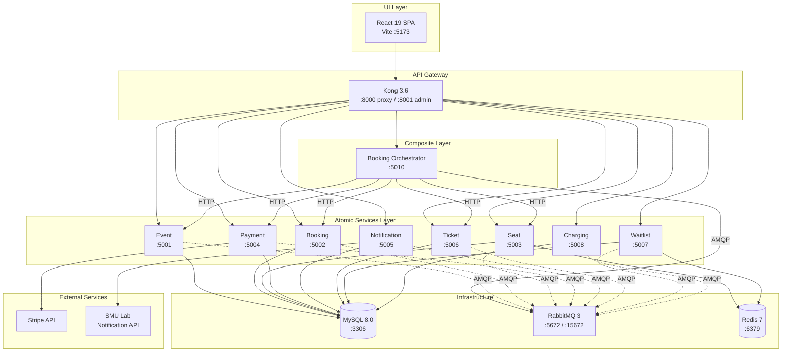
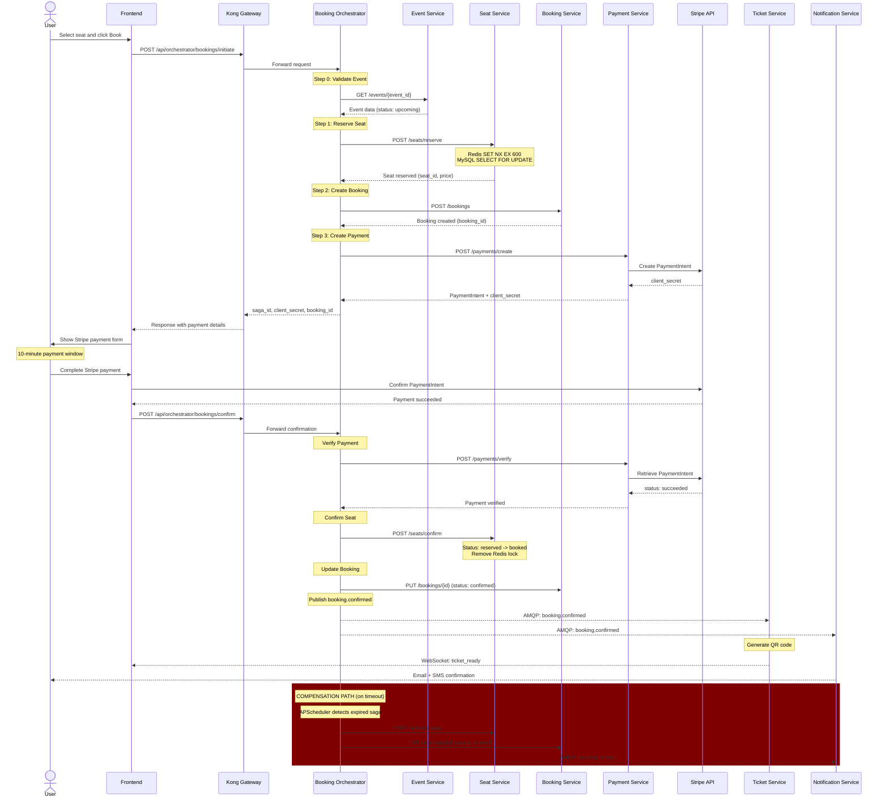
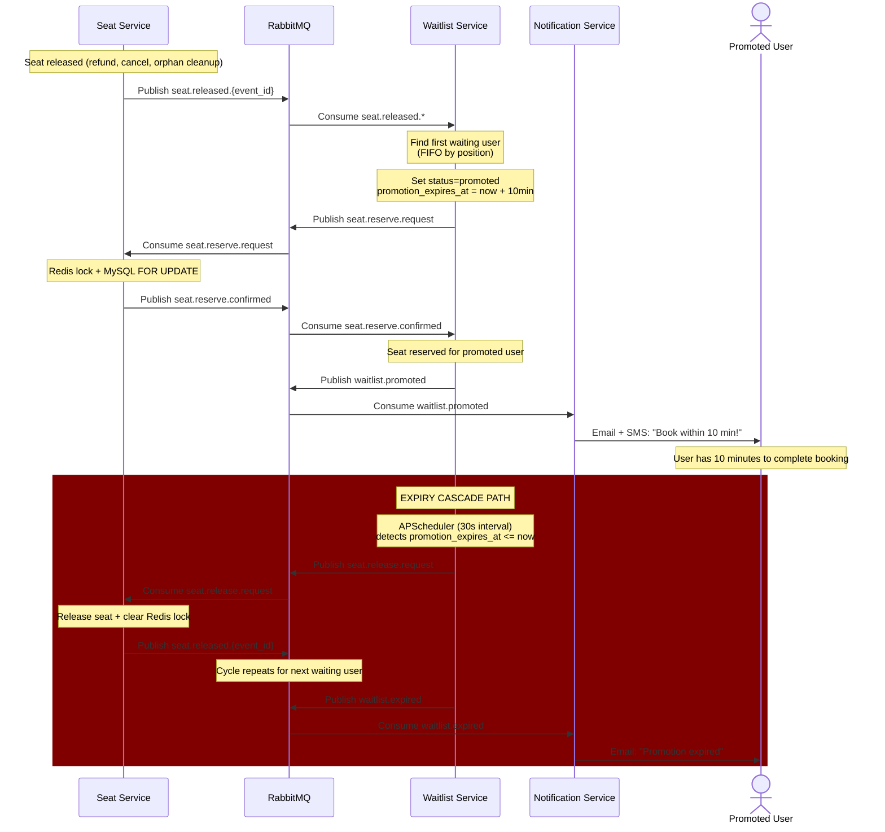
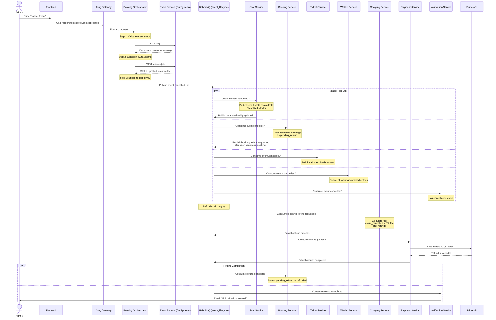

# Technical Overview: Event Ticketing Platform

## Table of Contents

1. [Executive Summary](#1-executive-summary)
2. [Service Catalog](#2-service-catalog)
3. [Database Schemas](#3-database-schemas)
4. [AMQP Messaging Topology](#4-amqp-messaging-topology)
5. [Architecture Diagrams](#5-architecture-diagrams)
6. [Kong API Gateway Configuration](#6-kong-api-gateway-configuration)
7. [OutSystems Recommendation](#7-outsystems-recommendation)
8. [Environment Variables Reference](#8-environment-variables-reference)

---

## 1. Executive Summary

This platform is a microservices-based event ticketing system built for the IS213 Enterprise Solution Development course at Singapore Management University. It allows users to browse events, book seats with real-time availability, make payments via Stripe, receive e-tickets with QR codes delivered over WebSocket, join waitlists for sold-out events, and request refunds with automated service fee calculation.

### Technology Stack

| Layer | Technology |
|-------|-----------|
| Backend Services | Python 3.11, Flask |
| Database | MySQL 8.0 |
| Message Broker | RabbitMQ 3 (AMQP 0-9-1) |
| Distributed Locking | Redis 7 |
| API Gateway | Kong 3.6 (DB-less declarative mode) |
| Frontend | React 19, Vite, TailwindCSS, shadcn/ui |
| Payments | Stripe API |
| Notifications | SMU Lab Notification API (Email, SMS, OTP) |
| Containerization | Docker Compose |

### User Scenarios

The platform supports three primary user scenarios, each demonstrating a different enterprise integration pattern:

1. **Seat Booking (Orchestration Saga)** -- A user selects a seat and completes payment through a multi-step saga orchestrated by the Booking Orchestrator. The saga coordinates seat reservation, booking creation, payment processing, ticket generation, and notification delivery. On failure or timeout, compensating transactions undo partial progress.

2. **Waitlist Promotion (Choreography)** -- When a seat is released, the Waitlist Service reacts to the `seat.released` event, promotes the next user in the FIFO queue, reserves the seat via AMQP, and notifies the user. The promoted user has a 10-minute window to complete booking before the promotion expires and cascades to the next user.

3. **Event Cancellation (Fan-Out)** -- An administrator cancels an event, triggering an `event.cancelled` message on the `event_lifecycle` topic exchange. Five services consume this event in parallel: Seat Service releases all seats, Booking Service marks bookings as pending refund, Ticket Service invalidates tickets, Waitlist Service cancels all entries, and Notification Service logs the cancellation. The Booking Service then triggers a downstream refund chain through the Charging and Payment services.

### Beyond-the-Lectures (BTL) Features

- **Kong API Gateway** -- Centralized routing, rate limiting (10 req/s), CORS management
- **Redis Distributed Locking** -- Dual-lock pattern (Redis SET NX EX + MySQL SELECT FOR UPDATE) for concurrent seat reservation
- **Flask-SocketIO WebSocket** -- Real-time e-ticket delivery to the browser after booking confirmation
- **Multi-threading** -- Each service runs Flask HTTP and pika AMQP consumers concurrently using Python daemon threads, enabling simultaneous request handling and event-driven message processing in a single process. APScheduler background threads handle saga timeout detection (Booking Orchestrator, 30s), orphaned seat cleanup (Seat Service, 60s), and waitlist promotion expiry (Waitlist Service, 30s)

---

## 2. Service Catalog

### Overview Table

| Service | Type | Port | Database | Description |
|---------|------|------|----------|-------------|
| Booking Service | Atomic | 5002 | booking_db | Booking record management; listens for event cancellation and refund completion |
| Seat Service | Atomic | 5003 | seat_db | Seat inventory with Redis distributed lock + MySQL FOR UPDATE; auto-assignment by proximity |
| Payment Service | Atomic | 5004 | payment_db | Stripe PaymentIntent creation/verification; refund processing with 3 retries and DLQ |
| Notification Service | Atomic | 5005 | notification_db | Email/SMS via SMU Lab Notification API; OTP verification; listens to 4 AMQP exchanges |
| Ticket Service | Atomic | 5006 | ticket_db | QR code generation (qrcode + Pillow); WebSocket delivery via Flask-SocketIO |
| Waitlist Service | Atomic | 5007 | waitlist_db | FIFO waitlist with choreography-based promotion; APScheduler for 10-min expiry detection |
| Charging Service | Atomic | 5008 | charging_db | Service fee calculation (10% retention on refunds); publishes `refund.process` to Payment |
| Booking Orchestrator | Composite | 5010 | saga_log_db | Saga orchestration for booking flow; calls atomic services via HTTP; APScheduler for payment timeout |

### 2.1 Event Service (OutSystems)

**Host:** OutSystems Cloud (`personal-fptjqc79.outsystemscloud.com`) | **Database:** OutSystems managed | **Type:** Atomic (External)

Migrated from Python/Flask to an OutSystems low-code REST API. Manages event lifecycle including creation, updates, and cancellation. Returns PascalCase field names (e.g., `EventDate`, `Status`) which the frontend normalizes to snake_case via `normalizeEvent()` in `client.js`. The Booking Orchestrator also handles PascalCase with dual-key lookups.

Since OutSystems cannot publish to RabbitMQ or consume AMQP messages, two capabilities are bridged by the Booking Orchestrator:
- **Event cancellation** — The orchestrator calls OutSystems to update the status, then publishes `event.cancelled` to RabbitMQ on its behalf
- **Seat availability sync** — The orchestrator consumes `seat.availability.updated` from RabbitMQ, then calls OutSystems PUT to update `AvailableSeats`

**REST API Endpoints (OutSystems):**

| Method | Path | Description |
|--------|------|-------------|
| GET | `/events` | List events with optional filters: `Status`, `Category` |
| GET | `/<event_id>` | Get a single event by ID |
| POST | `/events` | Create a new event |
| PUT | `/update/<event_id>` | Update event fields (including `AvailableSeats`) |
| POST | `/cancel/<event_id>` | Cancel an event (updates status to `cancelled` in OutSystems DB) |
| DELETE | `/delete/<event_id>` | Permanently delete an event |
| POST | `/fix-statuses` | Utility: bulk-update events with empty Status to `"upcoming"` |

**AMQP Interactions:** None (OutSystems cannot interact with RabbitMQ). See Booking Orchestrator (Section 2.9) for the bridged AMQP interactions.

---

### 2.2 Booking Service

**Port:** 5002 | **Database:** booking_db | **Type:** Atomic

Manages booking records with full status lifecycle (`pending`, `confirmed`, `cancelled`, `failed`, `expired`, `pending_refund`, `refunded`). Reacts to event cancellations by marking confirmed bookings as pending refund and publishing refund requests.

**REST API Endpoints:**

| Method | Path | Description |
|--------|------|-------------|
| GET | `/health` | Health check with database ping |
| GET | `/bookings/<booking_id>` | Get a single booking by ID |
| GET | `/bookings/user/<user_id>` | Get all bookings for a user (newest first) |
| GET | `/bookings` | List bookings with optional filters: `event_id`, `status` |
| POST | `/bookings` | Create a booking (required: `user_id`, `event_id`, `seat_id`, `email`, `amount`) |
| PUT | `/bookings/<booking_id>` | Update booking status or `payment_intent_id` |

**AMQP Interactions:**

| Direction | Exchange | Routing Key | Description |
|-----------|----------|-------------|-------------|
| Publishes | `booking_topic` (topic) | `booking.refund.requested` | Published for each confirmed booking when event is cancelled |
| Consumes | `event_lifecycle` (topic) | `event.cancelled.*` | Marks confirmed bookings as `pending_refund` |
| Consumes | `refund_topic` (topic) | `refund.completed` | Updates booking status to `refunded` |

**Queues:** `booking_cancel_queue`, `booking_refund_complete_queue`

---

### 2.3 Seat Service

**Port:** 5003 | **Database:** seat_db | **Type:** Atomic

Manages seat inventory with a dual-lock concurrency pattern: Redis `SET NX EX 600` provides a distributed lock, and MySQL `SELECT FOR UPDATE` ensures database-level consistency. When a requested seat is unavailable, the service auto-assigns the nearest available seat in the same section sorted by proximity (absolute distance of seat number). Uses `FOR UPDATE SKIP LOCKED` to avoid deadlocks under concurrent reservations. An APScheduler job runs every 60 seconds to clean up orphaned seats (reserved seats whose Redis locks have expired).

**REST API Endpoints:**

| Method | Path | Description |
|--------|------|-------------|
| GET | `/health` | Health check with database ping |
| POST | `/seats/setup` | Create sections and seats for a new event (required: `event_id`, `sections[]`) |
| GET | `/seats/event/<event_id>` | Get all seats for an event with section info |
| GET | `/seats/availability/<event_id>` | Get available seat count per section |
| POST | `/seats/reserve` | Reserve a seat with dual-lock and auto-assignment (required: `event_id`, `seat_id`, `user_id`) |
| POST | `/seats/release` | Release a reserved seat (verifies lock ownership) |
| POST | `/seats/confirm` | Confirm a reserved seat (changes to booked, removes Redis lock) |

**AMQP Interactions:**

| Direction | Exchange | Routing Key | Description |
|-----------|----------|-------------|-------------|
| Publishes | `seat_topic` (topic) | `seat.released.{event_id}` | Published when a seat is released (triggers waitlist promotion) |
| Publishes | `seat_topic` (topic) | `seat.availability.updated` | Published to sync available_seats count with Event Service |
| Publishes | `seat_topic` (topic) | `seat.reserve.confirmed` | Published when AMQP seat reservation succeeds (waitlist flow) |
| Publishes | `seat_topic` (topic) | `seat.reserve.failed` | Published when AMQP seat reservation fails (waitlist flow) |
| Consumes | `seat_topic` (topic) | `seat.reserve.request` | Handles seat reservation requests from Waitlist Service |
| Consumes | `seat_topic` (topic) | `seat.release.request` | Handles seat release requests from Waitlist Service (expired promotions) |
| Consumes | `event_lifecycle` (topic) | `event.cancelled.*` | Bulk-resets all reserved/booked seats and clears Redis locks |

**Queues:** `seat_reserve_queue`, `seat_release_queue`, `seat_cancel_queue`

**External Dependencies:** Redis 7 (distributed locking)

---

### 2.4 Payment Service

**Port:** 5004 | **Database:** payment_db | **Type:** Atomic

Integrates with the Stripe API for payment processing. Creates PaymentIntents for new bookings and verifies payment status. For refunds, consumes `refund.process` messages and attempts the Stripe refund with 3 retries. Failed refunds after all retries are published to a dead letter queue (`refund_dlq`) for manual intervention.

**REST API Endpoints:**

| Method | Path | Description |
|--------|------|-------------|
| GET | `/health` | Health check with database ping |
| POST | `/payments/create` | Create a Stripe PaymentIntent and record a pending transaction (required: `booking_id`, `user_id`, `amount`) |
| POST | `/payments/verify` | Verify a Stripe PaymentIntent and update transaction status (required: `payment_intent_id`) |
| GET | `/payments/transaction/<booking_id>` | Retrieve transaction by booking_id |

**AMQP Interactions:**

| Direction | Exchange | Routing Key | Description |
|-----------|----------|-------------|-------------|
| Publishes | `refund_topic` (topic) | `refund.completed` | Published after successful Stripe refund |
| Publishes | `refund_dlq` (direct) | `refund.failed` | Published to DLQ after 3 failed refund attempts |
| Consumes | `refund_direct` (direct) | `refund.process` | Processes refunds via Stripe with retry logic |

**Queue:** `payment_refund_queue`

**External Dependencies:** Stripe API (`STRIPE_SECRET_KEY`)

---

### 2.5 Notification Service

**Port:** 5005 | **Database:** notification_db | **Type:** Atomic

Sends email and SMS notifications via the SMU Lab Notification API. Supports OTP verification for phone number validation. Consumes events from four different AMQP exchanges covering booking confirmations, timeouts, waitlist promotions, event cancellations, and refund completions. All notifications are logged to the database with delivery status.

**REST API Endpoints:**

| Method | Path | Description |
|--------|------|-------------|
| GET | `/health` | Health check with database ping |
| GET | `/notifications/user/<user_id>` | Get notification history for a user (default limit: 50) |
| POST | `/notifications/otp/send` | Send OTP to a mobile number (required: `mobile`) |
| POST | `/notifications/otp/verify` | Verify OTP code (required: `verification_sid`, `code`) |

**AMQP Interactions:**

| Direction | Exchange | Routing Key | Description |
|-----------|----------|-------------|-------------|
| Consumes | `booking_topic` (topic) | `booking.confirmed` | Sends booking confirmation email + SMS |
| Consumes | `booking_topic` (topic) | `booking.timeout` | Sends booking expiry email |
| Consumes | `booking_topic` (topic) | `booking.refund.requested` | Sends refund request notification email |
| Consumes | `waitlist_topic` (topic) | `waitlist.promoted` | Sends promotion notification email + SMS |
| Consumes | `waitlist_topic` (topic) | `waitlist.expired` | Sends expiry notification email |
| Consumes | `event_lifecycle` (topic) | `event.cancelled.*` | Logs cancellation event (no user email in payload) |
| Consumes | `refund_topic` (topic) | `refund.completed` | Sends refund completion email |

**Queues:** `notification_booking_queue`, `notification_waitlist_queue`, `notification_lifecycle_queue`, `notification_refund_queue`

**External Dependencies:** SMU Lab Notification API (`SMU_NOTI_BASE_URL`, `SMU_NOTI_API_KEY`)

---

### 2.6 Ticket Service

**Port:** 5006 | **Database:** ticket_db | **Type:** Atomic

Generates QR code e-tickets using the `qrcode` and `Pillow` libraries. QR codes encode `{booking_id}:{validation_hash}` where the validation hash is a SHA-256 HMAC of the booking ID with a server-side secret. Tickets are delivered to the browser in real-time via Flask-SocketIO WebSocket (`async_mode=threading`). The WebSocket emits a lightweight `ticket_ready` notification (no QR image over WebSocket); the client then fetches the full ticket with base64-encoded QR image via HTTP.

**REST API Endpoints:**

| Method | Path | Description |
|--------|------|-------------|
| GET | `/health` | Health check with database ping |
| GET | `/tickets/booking/<booking_id>` | Get ticket by booking_id with base64 QR image |
| GET | `/tickets/<ticket_id>` | Get ticket by ticket_id with base64 QR image |
| POST | `/tickets/booking/<booking_id>/invalidate` | Invalidate a valid ticket (used during refunds) |

**WebSocket Events:**

| Event | Direction | Description |
|-------|-----------|-------------|
| `join` | Client -> Server | Client joins a room identified by `booking_id` |
| `ticket_ready` | Server -> Client | Emitted when ticket is generated (contains `ticket_id`, `booking_id`, `status`) |

**AMQP Interactions:**

| Direction | Exchange | Routing Key | Description |
|-----------|----------|-------------|-------------|
| Consumes | `booking_topic` (topic) | `booking.confirmed` | Generates QR ticket and emits WebSocket notification |
| Consumes | `event_lifecycle` (topic) | `event.cancelled.*` | Bulk-invalidates all valid tickets for the cancelled event |

**Queues:** `ticket_queue`, `ticket_cancel_queue`

---

### 2.7 Waitlist Service

**Port:** 5007 | **Database:** waitlist_db | **Type:** Atomic

Manages a FIFO waitlist queue per event. When a seat is released, the service promotes the first waiting user by requesting a seat reservation via AMQP (choreography pattern -- no direct HTTP calls to Seat Service). Promoted users have a 10-minute booking window enforced by `promotion_expires_at` timestamps. APScheduler checks for expired promotions every 30 seconds and cascades: the expired user's seat is released back, triggering the next user's promotion.

**REST API Endpoints:**

| Method | Path | Description |
|--------|------|-------------|
| GET | `/health` | Health check with database ping |
| POST | `/waitlist/join` | Join the waitlist (required: `event_id`, `user_id`, `email`) |
| GET | `/waitlist/position/<event_id>/<user_id>` | Get waitlist position and promotion status |

**AMQP Interactions:**

| Direction | Exchange | Routing Key | Description |
|-----------|----------|-------------|-------------|
| Publishes | `seat_topic` (topic) | `seat.reserve.request` | Requests seat reservation for promoted user |
| Publishes | `seat_topic` (topic) | `seat.released.{event_id}` | Re-publishes on reservation failure to try next user |
| Publishes | `seat_topic` (topic) | `seat.release.request` | Requests seat release for expired promotions |
| Publishes | `waitlist_topic` (topic) | `waitlist.promoted` | Notifies that a user has been promoted |
| Publishes | `waitlist_topic` (topic) | `waitlist.expired` | Notifies that a promotion has expired |
| Consumes | `seat_topic` (topic) | `seat.released.*` | Triggers promotion of first waiting user |
| Consumes | `seat_topic` (topic) | `seat.reserve.confirmed` | Confirms seat reservation succeeded |
| Consumes | `seat_topic` (topic) | `seat.reserve.failed` | Handles reservation failure, reverts user, retries next |
| Consumes | `event_lifecycle` (topic) | `event.cancelled.*` | Cancels all waiting/promoted entries for event |

**Queues:** `waitlist_queue`, `waitlist_confirm_queue`, `waitlist_cancel_queue`

---

### 2.8 Charging Service

**Port:** 5008 | **Database:** charging_db | **Type:** Atomic

Calculates service fees for refund processing. For voluntary refunds, a 10% service fee is retained and the remaining 90% is refunded. For event-cancelled refunds, no service fee is charged (full refund). After calculating, publishes `refund.process` to the `refund_direct` exchange for the Payment Service to execute the Stripe refund.

**REST API Endpoints:**

| Method | Path | Description |
|--------|------|-------------|
| GET | `/health` | Health check with database ping |
| GET | `/fees/event/<event_id>` | Get all service fees for an event with summary totals |
| GET | `/fees/booking/<booking_id>` | Get service fee for a specific booking |

**AMQP Interactions:**

| Direction | Exchange | Routing Key | Description |
|-----------|----------|-------------|-------------|
| Publishes | `refund_direct` (direct) | `refund.process` | Sends calculated refund amount to Payment Service |
| Consumes | `booking_topic` (topic) | `booking.refund.requested` | Receives refund requests, calculates fees |

**Queue:** `charging_refund_queue`

---

### 2.9 Booking Orchestrator

**Port:** 5010 | **Database:** saga_log_db | **Type:** Composite

The only composite service in the platform. Orchestrates the multi-step booking saga by making synchronous HTTP calls to atomic services in sequence. Maintains a saga log with status transitions (`STARTED` -> `SEAT_RESERVED` -> `PAYMENT_PENDING` -> `PAYMENT_SUCCESS` -> `CONFIRMED`). On failure at any step, compensating transactions undo partial progress (release seat, mark booking as failed). Uses optimistic locking on `PAYMENT_PENDING` status to prevent race conditions between the confirm endpoint and the APScheduler timeout checker. APScheduler runs every 30 seconds to detect expired sagas and trigger compensating transactions.

Also acts as a **bridge between OutSystems and RabbitMQ** for two capabilities that the migrated Event Service can no longer handle natively: event cancellation (publishes `event.cancelled` to RabbitMQ after calling OutSystems) and seat availability sync (consumes `seat.availability.updated` from RabbitMQ and calls OutSystems PUT to update `AvailableSeats`).

**REST API Endpoints:**

| Method | Path | Description |
|--------|------|-------------|
| GET | `/health` | Health check with database ping |
| POST | `/bookings/initiate` | Start booking saga: reserve seat, create booking, create payment intent (required: `user_id`, `event_id`, `seat_id`, `email`) |
| POST | `/bookings/confirm` | Finalize saga: verify payment, confirm seat, update booking, publish `booking.confirmed` (required: `saga_id`, `payment_intent_id`) |
| POST | `/bookings/<booking_id>/refund` | User-initiated voluntary refund with 24h cutoff enforcement |
| GET | `/sagas/<saga_id>` | Get saga status for frontend polling |
| POST | `/events/create` | Bridge: create event in OutSystems + set up sections/seats in Seat Service |
| POST | `/events/<event_id>/cancel` | Bridge: cancel event via OutSystems, then publish `event.cancelled` to RabbitMQ |

**AMQP Interactions:**

| Direction | Exchange | Routing Key | Description |
|-----------|----------|-------------|-------------|
| Publishes | `booking_topic` (topic) | `booking.confirmed` | Published after successful saga completion |
| Publishes | `booking_topic` (topic) | `booking.timeout` | Published when APScheduler detects expired saga |
| Publishes | `booking_topic` (topic) | `booking.refund.requested` | Published for voluntary user-initiated refunds |
| Publishes | `event_lifecycle` (topic) | `event.cancelled.{event_id}` | Bridge: published after OutSystems cancels an event |
| Consumes | `seat_topic` (topic) | `seat.availability.updated` | Bridge: syncs available_seats to OutSystems via HTTP PUT |

**Queue:** `event_availability_queue`

**HTTP Dependencies on Atomic Services:**

| Service | Endpoints Called |
|---------|----------------|
| Event Service (OutSystems) | `GET /{id}`, `POST /cancel/{id}`, `PUT /update/{id}` |
| Seat Service | `POST /seats/reserve`, `POST /seats/release`, `POST /seats/confirm` |
| Booking Service | `POST /bookings`, `PUT /bookings/{id}`, `GET /bookings/{id}` |
| Payment Service | `POST /payments/create`, `POST /payments/verify` |
| Ticket Service | `POST /tickets/booking/{id}/invalidate` |

---

## 3. Database Schemas

All databases are created by a single `db/init.sql` script executed on first boot via MySQL's docker-entrypoint-initdb.d mechanism.

### 3.1 event_db

```sql
CREATE TABLE events (
    event_id      INT AUTO_INCREMENT PRIMARY KEY,
    name          VARCHAR(255) NOT NULL,
    description   TEXT,
    category      VARCHAR(100),
    event_date    DATETIME NOT NULL,
    venue         VARCHAR(255),
    status        ENUM('upcoming', 'ongoing', 'completed', 'cancelled') DEFAULT 'upcoming',
    total_seats   INT NOT NULL,
    available_seats INT NOT NULL,
    price_min     DECIMAL(10, 2),
    price_max     DECIMAL(10, 2),
    image_url     VARCHAR(500),
    created_at    TIMESTAMP DEFAULT CURRENT_TIMESTAMP,
    updated_at    TIMESTAMP DEFAULT CURRENT_TIMESTAMP ON UPDATE CURRENT_TIMESTAMP,
    INDEX idx_status (status),
    INDEX idx_category (category),
    INDEX idx_event_date (event_date)
) ENGINE=InnoDB DEFAULT CHARSET=utf8mb4;
```

### 3.2 booking_db

```sql
CREATE TABLE bookings (
    booking_id        INT AUTO_INCREMENT PRIMARY KEY,
    user_id           VARCHAR(100) NOT NULL,
    event_id          INT NOT NULL,
    seat_id           INT NOT NULL,
    email             VARCHAR(255) NOT NULL,
    amount            DECIMAL(10, 2) NOT NULL,
    status            ENUM('pending', 'confirmed', 'cancelled', 'failed', 'expired',
                           'pending_refund', 'refunded') DEFAULT 'pending',
    payment_intent_id VARCHAR(255),
    created_at        TIMESTAMP DEFAULT CURRENT_TIMESTAMP,
    updated_at        TIMESTAMP DEFAULT CURRENT_TIMESTAMP ON UPDATE CURRENT_TIMESTAMP,
    INDEX idx_user_id (user_id),
    INDEX idx_event_id (event_id),
    INDEX idx_status (status)
) ENGINE=InnoDB DEFAULT CHARSET=utf8mb4;
```

### 3.3 seat_db

```sql
CREATE TABLE sections (
    section_id      INT AUTO_INCREMENT PRIMARY KEY,
    event_id        INT NOT NULL,
    name            VARCHAR(100) NOT NULL,
    price           DECIMAL(10, 2) NOT NULL,
    total_seats     INT NOT NULL,
    available_seats INT NOT NULL,
    INDEX idx_event_id (event_id)
) ENGINE=InnoDB DEFAULT CHARSET=utf8mb4;

CREATE TABLE seats (
    seat_id      INT AUTO_INCREMENT PRIMARY KEY,
    event_id     INT NOT NULL,
    section_id   INT NOT NULL,
    seat_number  VARCHAR(20) NOT NULL,
    status       ENUM('available', 'reserved', 'booked') DEFAULT 'available',
    reserved_by  VARCHAR(100),
    reserved_at  TIMESTAMP NULL,
    UNIQUE KEY uk_event_seat (event_id, seat_number),
    INDEX idx_event_section (event_id, section_id),
    INDEX idx_status (status)
) ENGINE=InnoDB DEFAULT CHARSET=utf8mb4;
```

### 3.4 payment_db

```sql
CREATE TABLE transactions (
    transaction_id          INT AUTO_INCREMENT PRIMARY KEY,
    booking_id              INT NOT NULL,
    user_id                 VARCHAR(100) NOT NULL,
    amount                  DECIMAL(10, 2) NOT NULL,
    currency                VARCHAR(3) DEFAULT 'SGD',
    stripe_payment_intent_id VARCHAR(255),
    status                  ENUM('pending', 'succeeded', 'failed', 'refunded',
                                 'refund_failed') DEFAULT 'pending',
    refund_amount           DECIMAL(10, 2) NULL,
    created_at              TIMESTAMP DEFAULT CURRENT_TIMESTAMP,
    updated_at              TIMESTAMP DEFAULT CURRENT_TIMESTAMP ON UPDATE CURRENT_TIMESTAMP,
    INDEX idx_booking_id (booking_id),
    INDEX idx_stripe_pi (stripe_payment_intent_id)
) ENGINE=InnoDB DEFAULT CHARSET=utf8mb4;
```

### 3.5 notification_db

```sql
CREATE TABLE notification_logs (
    log_id        INT AUTO_INCREMENT PRIMARY KEY,
    user_id       VARCHAR(100),
    email         VARCHAR(255),
    phone         VARCHAR(20),
    channel       ENUM('email', 'sms') NOT NULL,
    event_type    VARCHAR(100) NOT NULL,
    subject       VARCHAR(255),
    body          TEXT,
    status        ENUM('sent', 'failed', 'pending') DEFAULT 'pending',
    error_message TEXT NULL,
    created_at    TIMESTAMP DEFAULT CURRENT_TIMESTAMP,
    INDEX idx_user_id (user_id),
    INDEX idx_event_type (event_type)
) ENGINE=InnoDB DEFAULT CHARSET=utf8mb4;
```

### 3.6 ticket_db

```sql
CREATE TABLE tickets (
    ticket_id     INT AUTO_INCREMENT PRIMARY KEY,
    booking_id    INT NOT NULL UNIQUE,
    event_id      INT NOT NULL,
    user_id       VARCHAR(100) NOT NULL,
    seat_id       INT NOT NULL,
    qr_code_data  TEXT NOT NULL,
    qr_code_image LONGBLOB,
    status        ENUM('valid', 'used', 'invalidated') DEFAULT 'valid',
    created_at    TIMESTAMP DEFAULT CURRENT_TIMESTAMP,
    updated_at    TIMESTAMP DEFAULT CURRENT_TIMESTAMP ON UPDATE CURRENT_TIMESTAMP,
    INDEX idx_booking_id (booking_id),
    INDEX idx_event_id (event_id)
) ENGINE=InnoDB DEFAULT CHARSET=utf8mb4;
```

### 3.7 waitlist_db

```sql
CREATE TABLE waitlist_entries (
    entry_id             INT AUTO_INCREMENT PRIMARY KEY,
    event_id             INT NOT NULL,
    user_id              VARCHAR(100) NOT NULL,
    email                VARCHAR(255) NOT NULL,
    phone                VARCHAR(20),
    preferred_section    VARCHAR(100),
    position             INT NOT NULL,
    status               ENUM('waiting', 'promoted', 'expired', 'cancelled',
                               'booked') DEFAULT 'waiting',
    promoted_seat_id     INT NULL,
    promotion_expires_at TIMESTAMP NULL,
    created_at           TIMESTAMP DEFAULT CURRENT_TIMESTAMP,
    updated_at           TIMESTAMP DEFAULT CURRENT_TIMESTAMP ON UPDATE CURRENT_TIMESTAMP,
    INDEX idx_event_status (event_id, status),
    INDEX idx_user_event (user_id, event_id)
) ENGINE=InnoDB DEFAULT CHARSET=utf8mb4;
```

### 3.8 charging_db

```sql
CREATE TABLE service_fees (
    fee_id          INT AUTO_INCREMENT PRIMARY KEY,
    event_id        INT NOT NULL,
    booking_id      INT NOT NULL,
    original_amount DECIMAL(10, 2) NOT NULL,
    service_fee     DECIMAL(10, 2) NOT NULL,
    refund_amount   DECIMAL(10, 2) NOT NULL,
    status          ENUM('calculated', 'refund_initiated', 'refund_completed')
                    DEFAULT 'calculated',
    created_at      TIMESTAMP DEFAULT CURRENT_TIMESTAMP,
    INDEX idx_event_id (event_id),
    INDEX idx_booking_id (booking_id)
) ENGINE=InnoDB DEFAULT CHARSET=utf8mb4;
```

### 3.9 saga_log_db

```sql
CREATE TABLE saga_log (
    saga_id            VARCHAR(36) PRIMARY KEY,
    user_id            VARCHAR(100) NOT NULL,
    event_id           INT NOT NULL,
    seat_id            INT NULL,
    booking_id         INT NULL,
    payment_intent_id  VARCHAR(255) NULL,
    email              VARCHAR(255) NOT NULL,
    phone              VARCHAR(20) NULL,
    amount             DECIMAL(10, 2) NULL,
    status             ENUM('STARTED', 'SEAT_RESERVED', 'PAYMENT_PENDING',
                            'PAYMENT_SUCCESS', 'CONFIRMED', 'FAILED', 'TIMEOUT')
                       DEFAULT 'STARTED',
    error_message      TEXT NULL,
    expires_at         TIMESTAMP NOT NULL,
    created_at         TIMESTAMP DEFAULT CURRENT_TIMESTAMP,
    updated_at         TIMESTAMP DEFAULT CURRENT_TIMESTAMP ON UPDATE CURRENT_TIMESTAMP,
    INDEX idx_status_expires (status, expires_at),
    INDEX idx_user_id (user_id)
) ENGINE=InnoDB DEFAULT CHARSET=utf8mb4;
```

---

## 4. AMQP Messaging Topology

### 4.1 Exchanges

| Exchange | Type | Durable | Description |
|----------|------|---------|-------------|
| `booking_topic` | topic | Yes | Booking lifecycle events (confirmed, timeout, cancelled, refund requests) |
| `seat_topic` | topic | Yes | Seat availability events (released, reserve request/response, availability updates) |
| `event_lifecycle` | topic | Yes | Event lifecycle events (event.cancelled.{event_id}) |
| `waitlist_topic` | topic | Yes | Waitlist state changes (promoted, expired) |
| `refund_direct` | direct | Yes | Refund processing commands (refund.process) |
| `refund_topic` | topic | Yes | Refund completion events (refund.completed) |
| `refund_dlq` | direct | Yes | Dead letter exchange for failed refunds |
| `dlx_exchange` | fanout | Yes | General dead letter exchange for failed message processing |

### 4.2 Routing Keys

**booking_topic:**

| Routing Key | Publisher | Description |
|-------------|-----------|-------------|
| `booking.confirmed` | Booking Orchestrator | Saga completed successfully |
| `booking.timeout` | Booking Orchestrator | Payment window expired (10 min) |
| `booking.refund.requested` | Booking Service, Booking Orchestrator | Refund requested (event cancellation or voluntary) |

**seat_topic:**

| Routing Key | Publisher | Description |
|-------------|-----------|-------------|
| `seat.released.{event_id}` | Seat Service | Seat made available (release, orphan cleanup, event cancel) |
| `seat.reserve.request` | Waitlist Service | Request to reserve a specific seat for promoted user |
| `seat.reserve.confirmed` | Seat Service | Seat reservation via AMQP succeeded |
| `seat.reserve.failed` | Seat Service | Seat reservation via AMQP failed |
| `seat.release.request` | Waitlist Service | Request to release expired promotion seat |
| `seat.availability.updated` | Seat Service | Total available seats count changed |

**event_lifecycle:**

| Routing Key | Publisher | Description |
|-------------|-----------|-------------|
| `event.cancelled.{event_id}` | Booking Orchestrator | Published after OutSystems cancels the event (bridge) |

**waitlist_topic:**

| Routing Key | Publisher | Description |
|-------------|-----------|-------------|
| `waitlist.promoted` | Waitlist Service | User promoted from waitlist |
| `waitlist.expired` | Waitlist Service | Promotion window expired |

**refund_direct:**

| Routing Key | Publisher | Description |
|-------------|-----------|-------------|
| `refund.process` | Charging Service | Command to execute Stripe refund |

**refund_topic:**

| Routing Key | Publisher | Description |
|-------------|-----------|-------------|
| `refund.completed` | Payment Service | Stripe refund executed successfully |

**refund_dlq:**

| Routing Key | Publisher | Description |
|-------------|-----------|-------------|
| `refund.failed` | Payment Service | Stripe refund failed after 3 retries |

### 4.3 Queue-to-Service Binding Table

| Queue Name | Service | Exchange | Routing Keys |
|------------|---------|----------|--------------|
| `event_availability_queue` | Booking Orchestrator | `seat_topic` | `seat.availability.updated` |
| `booking_cancel_queue` | Booking | `event_lifecycle` | `event.cancelled.*` |
| `booking_refund_complete_queue` | Booking | `refund_topic` | `refund.completed` |
| `seat_reserve_queue` | Seat | `seat_topic` | `seat.reserve.request` |
| `seat_release_queue` | Seat | `seat_topic` | `seat.release.request` |
| `seat_cancel_queue` | Seat | `event_lifecycle` | `event.cancelled.*` |
| `payment_refund_queue` | Payment | `refund_direct` | `refund.process` |
| `notification_booking_queue` | Notification | `booking_topic` | `booking.confirmed`, `booking.timeout`, `booking.refund.requested` |
| `notification_waitlist_queue` | Notification | `waitlist_topic` | `waitlist.promoted`, `waitlist.expired` |
| `notification_lifecycle_queue` | Notification | `event_lifecycle` | `event.cancelled.*` |
| `notification_refund_queue` | Notification | `refund_topic` | `refund.completed` |
| `ticket_queue` | Ticket | `booking_topic` | `booking.confirmed` |
| `ticket_cancel_queue` | Ticket | `event_lifecycle` | `event.cancelled.*` |
| `waitlist_queue` | Waitlist | `seat_topic` | `seat.released.*` |
| `waitlist_confirm_queue` | Waitlist | `seat_topic` | `seat.reserve.confirmed`, `seat.reserve.failed` |
| `waitlist_cancel_queue` | Waitlist | `event_lifecycle` | `event.cancelled.*` |
| `charging_refund_queue` | Charging | `booking_topic` | `booking.refund.requested` |

---

## 5. Architecture Diagrams

### 5.1 SOA Layer Architecture



### 5.2 Scenario 1: Seat Booking Saga (Orchestration)



#### Workflow: Happy Path

**Initiate & Validate**

1. User sends a booking request via HTTP POST /bookings/initiate from the Event Ticketing UI through Kong API Gateway
2. Kong API Gateway forwards the request to the Booking Orchestrator
3. Booking Orchestrator validates the event: HTTP GET /events/{event_id} to Event Service, checking that the event status is `upcoming` or `ongoing`
4. Event Service returns the event data with status: upcoming

**Reserve Seat, Create Booking & Payment**

5. Booking Orchestrator calls HTTP POST /seats/reserve on Seat Service
6. Seat Service acquires a Redis distributed lock (SET NX EX 600) and then uses MySQL SELECT FOR UPDATE to reserve the seat atomically, returning the seat_id and section price
7. Booking Orchestrator calls HTTP POST /bookings on Booking Service to create a provisional booking record
8. Booking Service returns the booking_id with status: pending
9. Booking Orchestrator calls HTTP POST /payments/create on Payment Service
10. Payment Service creates a Stripe PaymentIntent via the Stripe API
11 & 12. Stripe API returns the PaymentIntent + client_secret back to the Payment Service, which stores the transaction and returns it to the Booking Orchestrator
13 & 14. Booking Orchestrator returns the saga_id, client_secret, and booking_id to the frontend via Kong. The user is redirected to the Stripe payment form with a 10-minute payment window

**Confirm Phase**

15 & 16. After the user completes Stripe payment, the Event Ticketing UI calls HTTP POST /bookings/confirm to the Booking Orchestrator through Kong API Gateway
17. Booking Orchestrator verifies the payment via HTTP POST /payments/verify to Payment Service
18 & 19. Payment Service retrieves the PaymentIntent from Stripe and confirms status: succeeded
20. Booking Orchestrator confirms the seat via HTTP POST /seats/confirm to Seat Service, changing the seat status from `reserved` to `booked` and removing the Redis lock
21. Booking Orchestrator updates the booking via HTTP PUT /bookings/{id} to Booking Service, setting status: confirmed
22. Booking Orchestrator publishes `booking.confirmed` to the `booking_topic` exchange via RabbitMQ (AMQP)
23. Ticket Service consumes `booking.confirmed`, generates a QR code e-ticket (SHA-256 HMAC validation hash), and emits a WebSocket `ticket_ready` event directly to the frontend (bypasses Kong, port 5006)
24. Notification Service consumes `booking.confirmed` and sends a confirmation email and SMS via the SMU Lab Notification API

#### Workflow: Compensation Path (Timeout or Payment Failure)

APScheduler in the Booking Orchestrator runs every 30 seconds and detects sagas in `PAYMENT_PENDING` status past their 10-minute `expires_at` timestamp.

1. Booking Orchestrator calls HTTP POST /seats/release to Seat Service, which marks the seat as `available` and removes the Redis distributed lock
2. Booking Orchestrator calls HTTP PUT /bookings/{id} to Booking Service, setting the booking status to `expired` (for timeout) or `failed` (for payment failure)
3. Booking Orchestrator publishes `booking.timeout` to the `booking_topic` exchange via RabbitMQ (AMQP)
4. Notification Service consumes `booking.timeout` and sends an expiry notification email via the SMU Lab Notification API

### 5.3 Scenario 2: Waitlist Promotion (Choreography)



#### Workflow: Happy Path (Seat Released -> Promotion)

1. A seat becomes available (via refund, booking cancellation, or orphaned seat cleanup). Seat Service publishes `seat.released.{event_id}` to the `seat_topic` exchange via RabbitMQ (AMQP)
2. Waitlist Service consumes `seat.released.*` and finds the first user in `waiting` status for that event (FIFO by position)
3. Waitlist Service sets the user's status to `promoted` with `promotion_expires_at` = now + 10 minutes
4. Waitlist Service publishes `seat.reserve.request` to the `seat_topic` exchange via RabbitMQ, requesting the Seat Service to reserve the released seat for the promoted user
5. Seat Service consumes `seat.reserve.request`, acquires the Redis lock and MySQL FOR UPDATE lock, and reserves the seat
6. Seat Service publishes `seat.reserve.confirmed` to the `seat_topic` exchange via RabbitMQ
7. Waitlist Service consumes `seat.reserve.confirmed` and records the `promoted_seat_id` on the waitlist entry
8. Waitlist Service publishes `waitlist.promoted` to the `waitlist_topic` exchange via RabbitMQ
9. Notification Service consumes `waitlist.promoted` and sends the user an email + SMS via the SMU Lab Notification API, informing them to complete booking within 10 minutes

The promoted user then follows the Scenario 1 booking flow (initiate -> confirm) to complete their purchase.

#### Workflow: Expiry Cascade Path

APScheduler in the Waitlist Service runs every 30 seconds and detects entries with `status=promoted` and `promotion_expires_at <= now`.

1. Waitlist Service sets the expired user's status to `expired`
2. Waitlist Service publishes `seat.release.request` to the `seat_topic` exchange via RabbitMQ, asking Seat Service to release the reserved seat
3. Seat Service consumes `seat.release.request`, releases the seat (marks as `available`), and clears the Redis lock
4. Seat Service publishes `seat.released.{event_id}` back to the `seat_topic` exchange, which triggers the promotion cycle again for the next waiting user (step 1 of Happy Path above)
5. Waitlist Service publishes `waitlist.expired` to the `waitlist_topic` exchange via RabbitMQ
6. Notification Service consumes `waitlist.expired` and sends the expired user an email notification

If no more users remain on the waitlist, the seat stays available for direct booking.

### 5.4 Scenario 3: Event Cancellation (Fan-Out)



#### Workflow: Fan-Out + Refund Chain

**Fan-Out Phase (Parallel)**

1. Admin clicks "Cancel Event" on the EventDetailPage. The frontend calls HTTP POST /api/orchestrator/events/{id}/cancel through Kong API Gateway, which routes to the Booking Orchestrator
2. Booking Orchestrator validates the event by calling OutSystems GET /{id} to confirm status is `upcoming` or `ongoing`
3. Booking Orchestrator calls OutSystems POST /cancel/{id} to update the event status to `cancelled`
4. Booking Orchestrator publishes `event.cancelled.{event_id}` to the `event_lifecycle` topic exchange via RabbitMQ (AMQP) — acting as a bridge since OutSystems cannot publish to RabbitMQ
5. Five services consume `event.cancelled.*` in parallel:
   - **Seat Service:** Bulk-resets all reserved/booked seats to `available` and clears all Redis distributed locks for that event. Publishes `seat.availability.updated` to `seat_topic`
   - **Booking Service:** Finds all bookings with status `confirmed` for the event, sets each to `pending_refund`, and publishes `booking.refund.requested` to `booking_topic` for each affected booking
   - **Ticket Service:** Bulk-invalidates all tickets with status `valid` for the event
   - **Waitlist Service:** Cancels all waitlist entries with status `waiting` or `promoted` for the event
   - **Notification Service:** Logs the cancellation event to the database (no email sent — the `event.cancelled` payload does not contain individual user information)

**Refund Chain (Sequential)**

6. Charging Service consumes `booking.refund.requested` from `booking_topic`. For event-cancelled refunds, the service fee is 0% (full refund). It calculates the refund amount and publishes `refund.process` to the `refund_direct` exchange via RabbitMQ
7. Payment Service consumes `refund.process` from `refund_direct` and issues a Stripe refund via the Stripe API with up to 3 retry attempts (1-second delay between retries)
8. On success, Payment Service publishes `refund.completed` to the `refund_topic` exchange via RabbitMQ. On failure after 3 retries, it publishes `refund.failed` to the `refund_dlq` dead letter exchange for manual intervention
9. Two services consume `refund.completed` in parallel:
   - **Booking Service:** Updates the booking status from `pending_refund` to `refunded`
   - **Notification Service:** Sends a refund confirmation email to the user via the SMU Lab Notification API

---

## 6. Kong API Gateway Configuration

Kong 3.6 runs in DB-less mode with declarative YAML configuration (`kong/kong.yml`).

### 6.1 Route Table

| Gateway Path | Service Name | Upstream URL | Description |
|--------------|-------------|--------------|-------------|
| `/api/events` | event-service | `https://personal-fptjqc79.outsystemscloud.com/ESDTicketBookingServices/rest/EventService/events` | Event list (OutSystems) |
| `/api/event` | event-detail-service | `https://personal-fptjqc79.outsystemscloud.com/ESDTicketBookingServices/rest/EventService` | Event detail by ID (OutSystems) |
| `/api/bookings` | booking-service | `http://booking:5002/bookings` | Booking queries and management |
| `/api/seats` | seat-service | `http://seat:5003/seats` | Seat availability and reservation |
| `/api/payments` | payment-service | `http://payment:5004/payments` | Payment creation and verification |
| `/api/notifications` | notification-service | `http://notification:5005/notifications` | Notification history and OTP |
| `/api/tickets` | ticket-service | `http://ticket:5006/tickets` | Ticket retrieval |
| `/api/waitlist` | waitlist-service | `http://waitlist:5007/waitlist` | Waitlist join and position queries |
| `/api/charging` | charging-service | `http://charging:5008/fees` | Fee queries |
| `/api/orchestrator` | orchestrator-service | `http://booking_orchestrator:5010` | Booking saga, event cancel bridge, refunds |
| `/api/sagas` | orchestrator-sagas-service | `http://booking_orchestrator:5010/sagas` | Saga status polling |

All routes use `strip_path: true`, meaning the gateway prefix (e.g., `/api/events`) is stripped before forwarding to the upstream service.

### 6.2 Global Plugins

**Rate Limiting:**
- **Plugin:** `rate-limiting`
- **Configuration:** 10 requests per second per client
- **Policy:** `local` (per-node counter)

**CORS:**
- **Plugin:** `cors`
- **Allowed Origins:** `http://localhost:5173`, `http://localhost:5174`
- **Allowed Methods:** GET, POST, PUT, DELETE, OPTIONS
- **Allowed Headers:** Content-Type, X-Correlation-ID, Accept
- **Credentials:** `false`
- **Max Age:** 3600 seconds

---

## 7. OutSystems Recommendation

### Migrated Service: Event Service

The **Event Service** has been migrated from Python/Flask to an OutSystems low-code REST API hosted on OutSystems Cloud.

### Why Event Service

1. **Simplest CRUD operations.** The Event Service exposes straightforward REST endpoints that map directly to OutSystems Server Actions and Screen Aggregates with no complex business logic in the critical path.

2. **Admin-facing use case.** Event management (creating, editing, cancelling events) is naturally suited to OutSystems form builders and list screens.

3. **No real-time requirements.** The Event Service does not require WebSocket connections, Redis distributed locking, or other infrastructure that OutSystems cannot natively handle.

4. **Demonstrates OutSystems triggering complex backend flows.** When an admin cancels an event, the cancel request goes through the Booking Orchestrator which calls OutSystems to update the status and then publishes `event.cancelled` to RabbitMQ, triggering the full fan-out cancellation scenario across all backend services. This demonstrates OutSystems as a low-code platform driving sophisticated event-driven architecture.

### Migration Architecture

Since OutSystems cannot interact with RabbitMQ (no AMQP support), the **Booking Orchestrator** acts as a bridge for two capabilities:

| Capability | How It Works |
|-----------|-------------|
| **Event Cancellation** | Frontend calls `POST /api/orchestrator/events/{id}/cancel` -> Orchestrator calls OutSystems `POST /cancel/{id}` -> Orchestrator publishes `event.cancelled.{event_id}` to RabbitMQ |
| **Seat Availability Sync** | Seat Service publishes `seat.availability.updated` to RabbitMQ -> Orchestrator consumes message -> Orchestrator calls OutSystems `PUT /update/{id}` with updated `AvailableSeats` |

### Adaptations Made

| Change | File | Description |
|--------|------|-------------|
| Kong routes to OutSystems | `kong/kong.yml` | Event service URLs now point to OutSystems Cloud instead of local Python container |
| PascalCase normalization | `frontend/src/api/client.js` | `normalizeEvent()` function maps OutSystems PascalCase fields to snake_case |
| Dual-key lookups | `services/booking_orchestrator/app.py` | Checks both `Status`/`status` and `EventDate`/`event_date` in event responses |
| Cancel bridge route | `services/booking_orchestrator/app.py` | New `POST /events/{id}/cancel` endpoint bridges OutSystems -> RabbitMQ |
| Availability consumer | `services/booking_orchestrator/app.py` | New AMQP consumer thread syncs `seat.availability.updated` to OutSystems |
| Frontend cancel path | `frontend/src/pages/EventDetailPage.jsx` | Cancel calls go to `/api/orchestrator/events/{id}/cancel` instead of `/api/events/{id}/cancel` |

### OutSystems REST API

Hosted at: `https://personal-fptjqc79.outsystemscloud.com/ESDTicketBookingServices/rest/EventService`

| Operation | Method | Path |
|-----------|--------|------|
| List events | GET | `/events` |
| Get event by ID | GET | `/{id}` |
| Create event | POST | `/events` |
| Update event | PUT | `/update/{id}` |
| Cancel event | POST | `/cancel/{id}` |

See `OUTSYSTEMS_MIGRATION_GUIDE.md` for the full migration guide including all issues encountered and fixes applied.

---


## 8. Environment Variables Reference

### Infrastructure Services

| Variable | Default | Used By | Description |
|----------|---------|---------|-------------|
| `MYSQL_ROOT_PASSWORD` | `root` | MySQL, all services | MySQL root password |
| `RABBITMQ_USER` | `guest` | RabbitMQ | RabbitMQ default username |
| `RABBITMQ_PASS` | `guest` | RabbitMQ | RabbitMQ default password |

### Per-Service Variables

All backend services share the following common variables:

| Variable | Default | Description |
|----------|---------|-------------|
| `DB_HOST` | `mysql` | MySQL hostname (Docker service name) |
| `DB_PORT` | `3306` | MySQL port |
| `DB_USER` | `root` | MySQL username |
| `DB_PASSWORD` | `root` | MySQL password |
| `DB_NAME` | varies | Service-specific database name |
| `RABBITMQ_HOST` | `rabbitmq` | RabbitMQ hostname |
| `PORT` | varies | Flask application port |

### Service-Specific Variables

| Variable | Service | Required | Description |
|----------|---------|----------|-------------|
| `STRIPE_SECRET_KEY` | Payment Service | Yes | Stripe API secret key for payment processing |
| `SMU_NOTI_BASE_URL` | Notification Service | Yes | Base URL for SMU Lab Notification API |
| `SMU_NOTI_API_KEY` | Notification Service | Yes | API key for SMU Lab Notification API |
| `REDIS_HOST` | Seat Service | No (default: `redis`) | Redis hostname |
| `REDIS_PORT` | Seat Service | No (default: `6379`) | Redis port |
| `EVENT_SERVICE_URL` | Booking Orchestrator | Yes | OutSystems Event Service REST API base URL |
| `SEAT_SERVICE_URL` | Booking Orchestrator | No (default: `http://seat:5003`) | Seat Service internal URL |
| `PAYMENT_SERVICE_URL` | Booking Orchestrator | No (default: `http://payment:5004`) | Payment Service internal URL |
| `BOOKING_SERVICE_URL` | Booking Orchestrator | No (default: `http://booking:5002`) | Booking Service internal URL |
| `TICKET_SERVICE_URL` | Booking Orchestrator | No (default: `http://ticket:5006`) | Ticket Service internal URL |
| `QR_SECRET` | Ticket Service | No (default: `ticket-validation-secret`) | Secret key for QR code validation hash |

### Kong Gateway Variables

| Variable | Value | Description |
|----------|-------|-------------|
| `KONG_DATABASE` | `off` | DB-less declarative mode |
| `KONG_DECLARATIVE_CONFIG` | `/etc/kong/kong.yml` | Path to declarative config |
| `KONG_PROXY_LISTEN` | `0.0.0.0:8000` | Proxy listener address |
| `KONG_ADMIN_LISTEN` | `0.0.0.0:8001` | Admin API listener address |

### Port Summary

| Service | Port |
|---------|------|
| Event Service | 5001 |
| Booking Service | 5002 |
| Seat Service | 5003 |
| Payment Service | 5004 |
| Notification Service | 5005 |
| Ticket Service | 5006 |
| Waitlist Service | 5007 |
| Charging Service | 5008 |
| Booking Orchestrator | 5010 |
| Frontend (React/Vite) | 5173 |
| MySQL | 3306 |
| RabbitMQ (AMQP) | 5672 |
| RabbitMQ (Management UI) | 15672 |
| Redis | 6379 |
| Kong (Proxy) | 8000 |
| Kong (Admin API) | 8001 |
